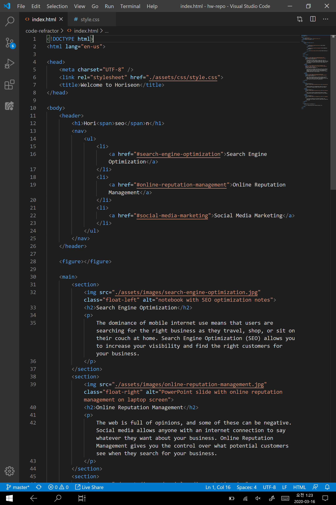
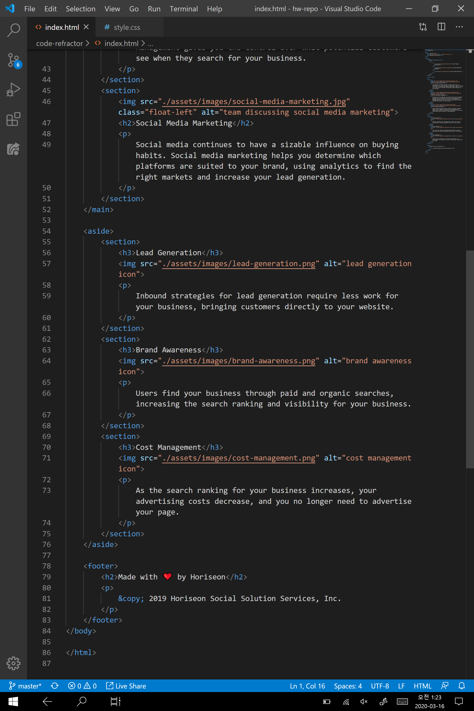
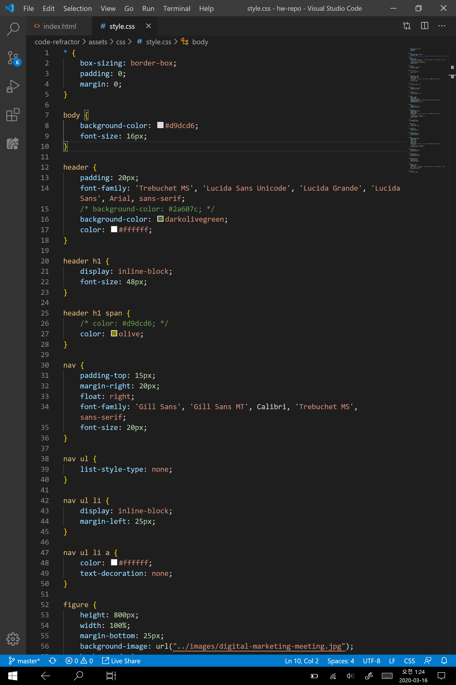
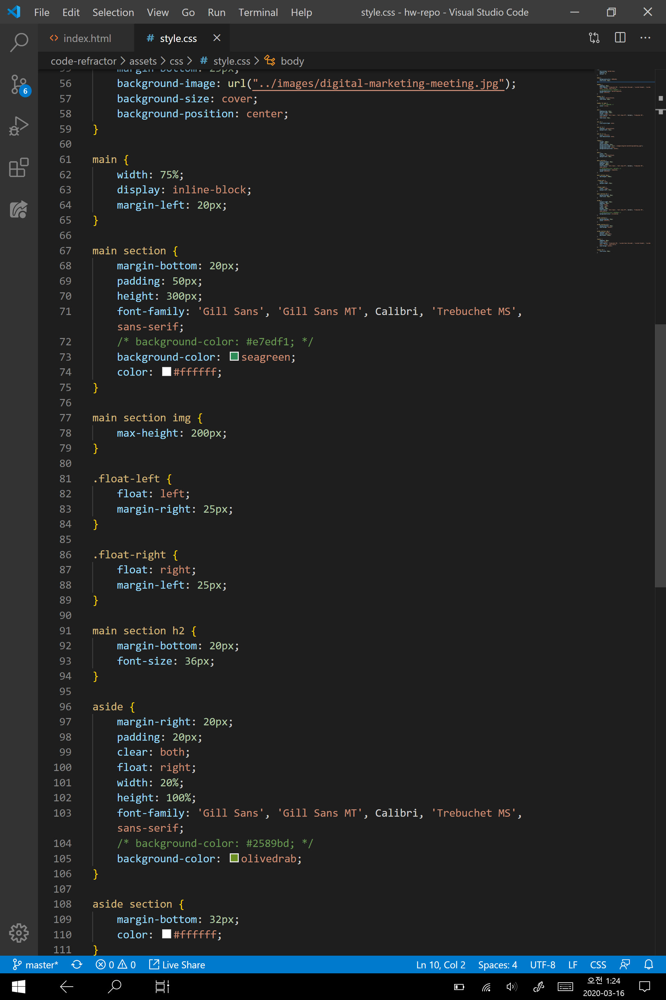
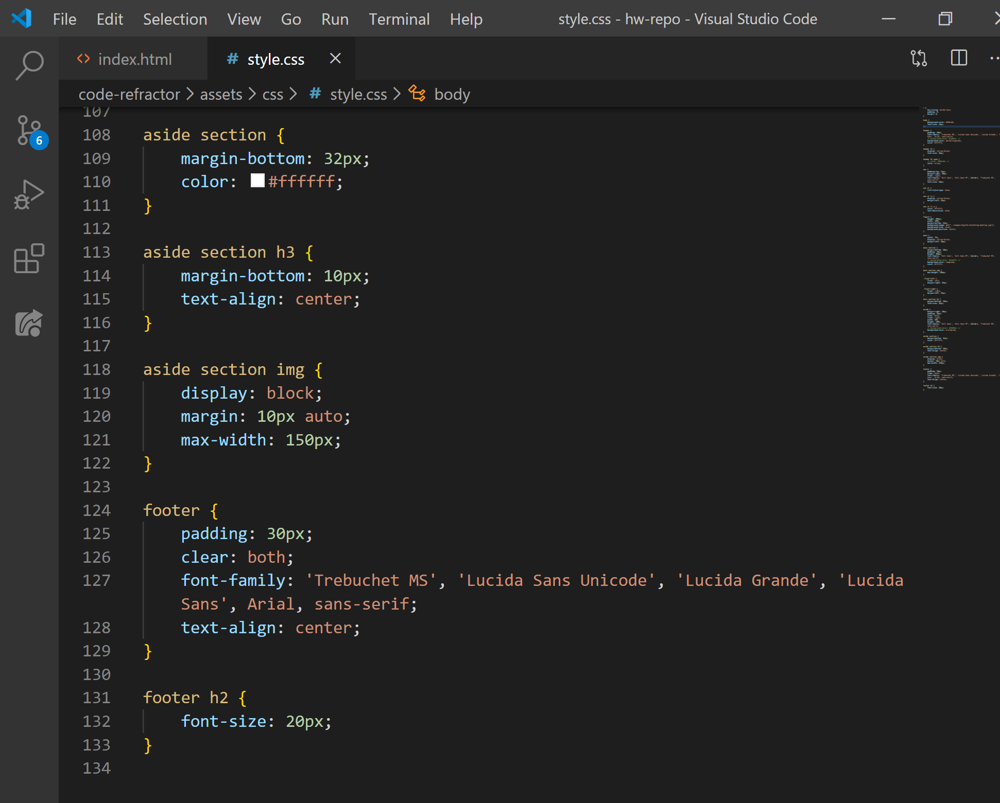

# Homework - Code Refractor
UCBE Week01 Code Refractor homework

  * ## Project Description
    
    For this project, I had to clean up redundant code in a messy, but functioning HTML/CSS code, rename semantics and do an overall re-arrangement for a cleaner, more coherent read.
  
  * ## Technologies Used

    I used HTML/CSS for this project. For HTML, I fulfilled the specifications requirement by using semantics tag such as &lt;header&gt;, &lt;nav&gt;, &lt;figure&gt;, &lt;main&gt;, &lt;aside&gt;, &lt;section&gt; and &lt;footer&gt;. 
    
    I also got rid of redundant id's that did not have any CSS styling attached, and cleaned up the CSS stylesheet to be more consistent and coherent. For me it was a stylist preference to refer to elements by their location rather than assigning them with an id each time (i.e. "header h1 span" instead of assigning the span tag with an id).

  * ## Screenshots of Essential Code
    * HTML Below
    
    
    
    * CSS Below
    
    
    
        
  * ## Gif Walkthrough of App Functioning 
    
    This is a static webpage so it does not have an animated gif.

    